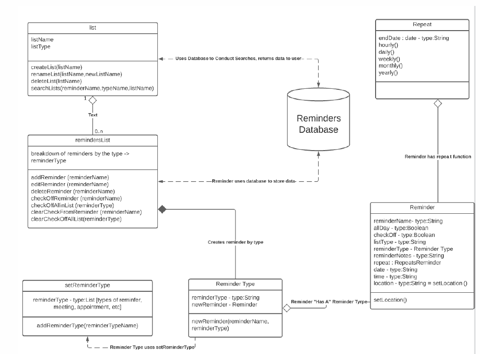
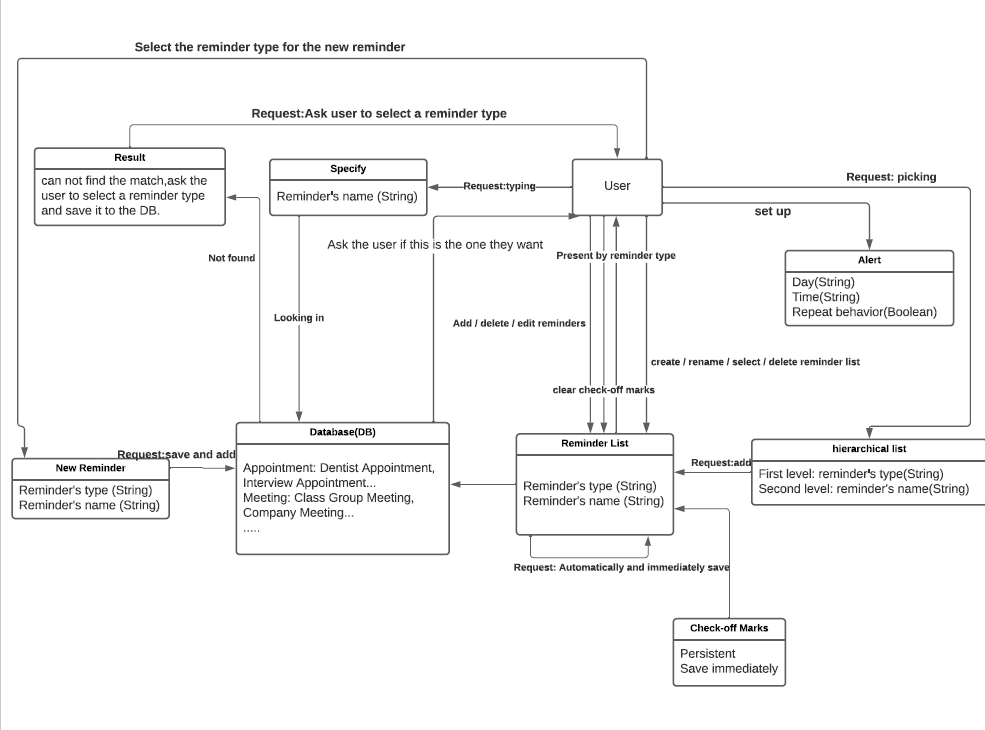
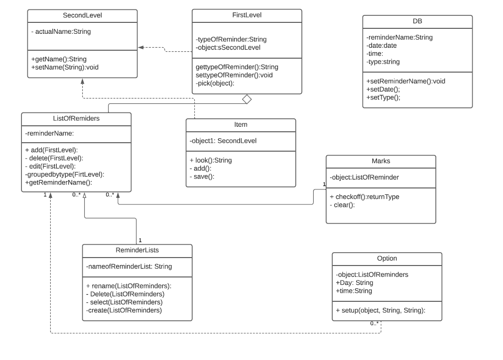
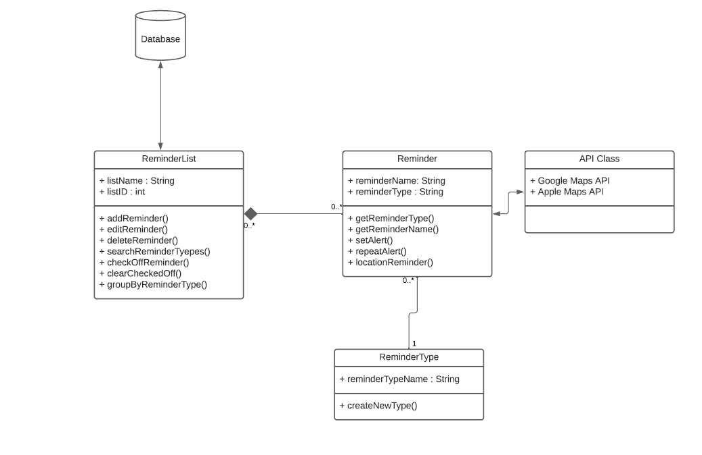
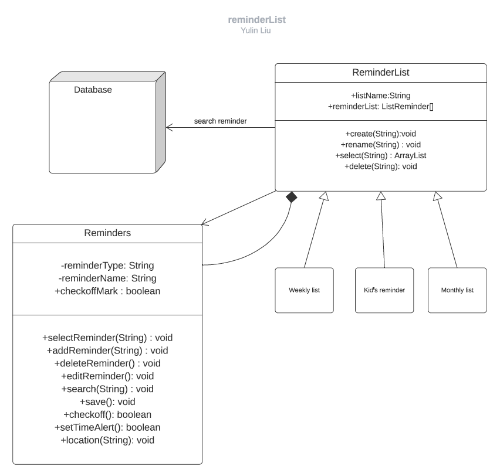
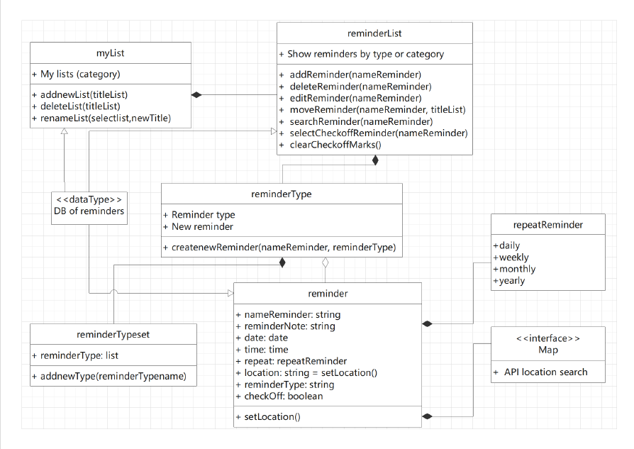
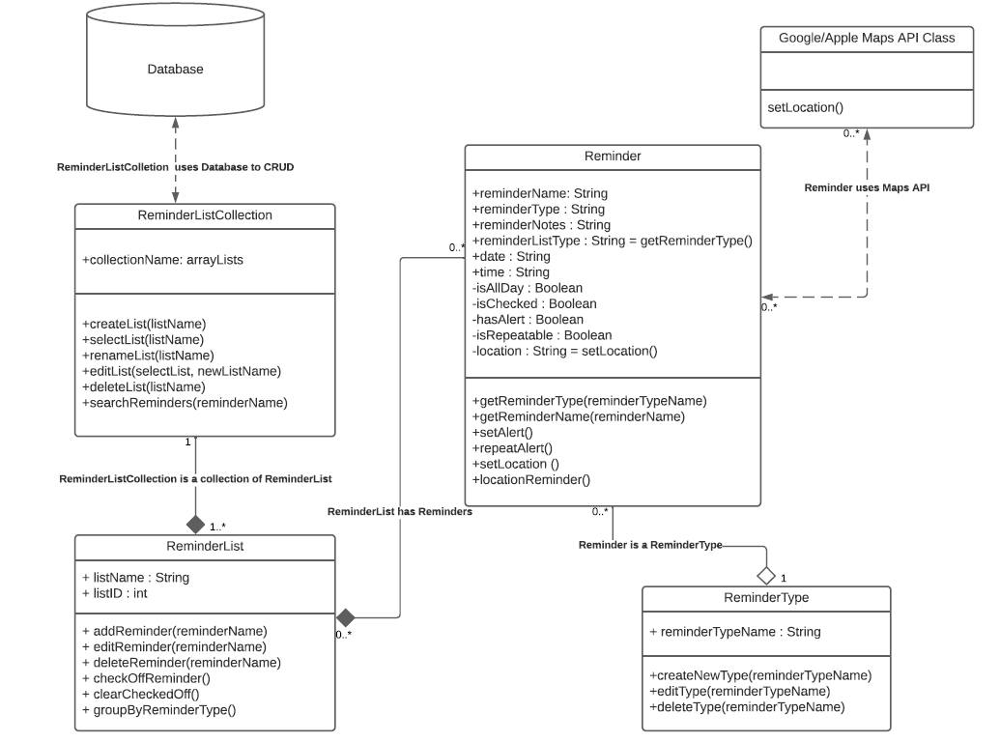

<!--    -->

Design 1: Aman 

- The design is very clear.
- The text defines the relationships and how each entity interact.
- The veriables names and methods are well defined and named appropriately.
- Attributes have datatypes
- User class with user attributes, i.e, name, email address, etc.
- Too many classes, could have consolidated a bit. For example, the setReminder class could have
  been a part of the ReminderType class.

---

Design 2(Brian)

- Describes the relationships, methods, and classes very well.
- Too complicated, too many classes.
- Too many lines makes it a bit difficult to follow.

---

Design 3(Doris)

- It has the requirements listed.
- Describes the multiplicies between the classes.
- Each class is easy to understand.
- Could also consolidate some of the classes.
- Needs more details on the relationships between classes.
- No relationship between the database.
- Some wrong visibly marks in some of the classes.

---

Design 4(David)

- Easy to follow and understand.
- The variables and methods are well named.
- It forfills the requirements.
- No description text between classes.
- No relationship arrow between Reminder class and ReminderType class.
- Unsure if relationship Reminder class and API class is correct.

---

Design 5(Yulin)

- Variables have datatypes and well named.
- The design is too simple.
- The three boxes (weekly, kid's reminders, monthly list) are confusing.
- Lacking detail of relationships.

---

Design 5(Heather)

---

Team design:

We decided to pull elements from Aman's, Brian's, and David's design. Taking David's simplier approach to the classes,
while using the more detailed approach of Aman's and Brian's designs.

Commomanlities:

- They all had reminder and reminder types has seperate classes.
- All designs had a list viewer of some sort.
- The designs met the requriements.

Differences:

- Some of the designs had more detailed text describing the relationships between the enities.
- Some of the designs were more simplier vs some that were more complex (i.e. having one class vs two classes for the
  same functionality).

Summary:
When we came together to discuss the designs as a team, I think it helped us realize that we needed to be honest in
our critiques in order to achieve a better team design. In turn, we were able to see which classes were redundant in our
individual designs and how we could better streamline the final design to avoid complex classes and relationships. By being
able to list the pros and cons of each design, it gaves us three designs we can work with and use as a template and starting
off point for the team design. We believe we have been able to forfill the requirements as listed while having an
efficient UML design.
